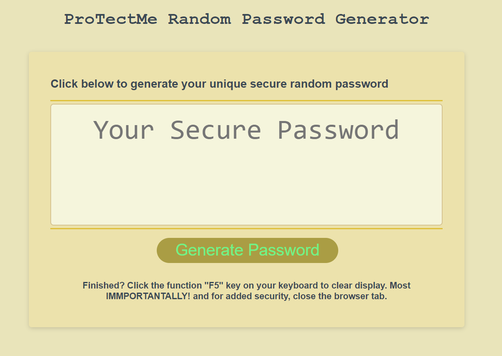

# Application

ProTectMe Random Secure Password Generator

## Application Description

ProTechMe Random Secure Password Generator application is an extremely simple to use tool that effectively provides a random secure password utilizing a few clicks.

## Purpose of a Password

Passwords are used primarily to "protect" users from anyone accessing their app logins without permission. There are many levels of categorizing what methods to follow in creating a secure password. For example, one of the most common category is based on whether a password is weak or strong. The password's level of weakness or strength helps to avoid being deciphered based on information collected when creating or logging in to apps that require username and password. 

## Application Functionality

This application automatically generates a random secure password based on user's selection of how many characters the password will be and which type of characters they want to include in creating their password.

Required criteria for user input or selection are:
  *Must be 8 or more characters in length up to maximum 128
  *Must select at "least one" of the character types of:
   ** Uppercase characters (A, B, C, D, etc.)
   ** Lowercase characters(a, b, c, d, etc.)
    Numeric characters (0-9)
    Special character (i.e #, *, >, !, etc.)

* Adherence to the two "Must" is vital to successfully generate the password.
** Uniqueness utilizing shuffleArray and manually re-ordering two arrays in a non-alphabetical order.

## Recommendation when creating password

When using this application, it is recommended to create the strongest password by selecting a length of 12 or more characters AND to include ALL character types. This application has a "unique feature of randomness" developed to strengthen character selections. Unlike conventional methods, e.g. the standard order of the modern ISO basic Latin alphabet, the formulation of the uppercase and lowercase character type data sources deviate from normal arrangement.

In addition to the shuffleArray function, the unique feature of randomness is designed to use a combination of uppercase or lowercase letters, numbers, and special characters to form an unpredictable string of characters.

## Need for using a secure password

A strong password should be unique for each account to reduce vulnerability in the event of a hack. Using a random password generator, allow users to generate different passwords for various personal accounts. Buinesses utilize random password generators to create unique passwords for their employees as a means to manage levels of access or denial of access and in some cases to monitor usage.

Remembering strong passwords is difficult; therefore, it is recommended that you jot it down and place in a secure place or add to your password manager.

## Let's get started!

## Generate Password

Copy the link and paste in your favorite browser or click this link ****ADD THE LINK*** to launch the ProTectMe Random Secure Password Generator. 

Application image upon launch:

Follow the prompts to generate with length and character selections as shown in image:  AlertsSelectionMsg_ProTectMeRPG.png

You can generate one or more random secure passwords by clicking the generate password button to create a different one or to create several. The random secure password cannot be saved, therefore, please remember to jot down before generating another one.

Application image of a generated password: 

## Finish Actions

Click the function F5 key on your keyboard to clear display. Most IMMPORTANTALLY! and for added security, close the browser tab.    

If you have any questions, need assistance, or would like to contribute, please send a message via github at https://github.com.

## Credits, contributions and Acknowledgments from resouce searches on www.google.com:

    W3 Schools https://www.w3schools.com/js/default.asp
    MDN at: https://developer.mozilla.org/en-US/docs/Glossary/RNG
    ShuffleArray research at: http://php.net/manual/en/function.shuffle.php
    Grepper on randomize arrays research at:  ShuffleArray research at : codegrepper.com/code-examples/javascript
